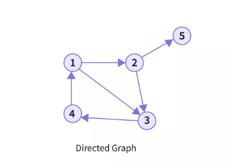
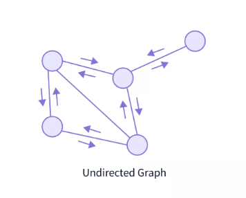

# Graphs

## What is Graph Data Structure?

A Graph is a non-linear data structure consisting of vertices and edges. The vertices are sometimes also referred to as nodes and the edges are lines or arcs that connect any two nodes in the graph. More formally a Graph is composed of a set of vertices(V) and a set of edges(E). The graph is denoted by G(E, V).

## Components of a Graph

- **Vertices**: Vertices are the fundamental units of the graph. Sometimes, vertices are also known as vertex or nodes. Every node/vertex can be labeled or unlabelled.

- **Edges**: Edges are drawn or used to connect two nodes of the graph. It can be ordered pair of nodes in a directed graph. Edges can connect any two nodes in any possible way. There are no rules. Sometimes, edges are also known as arcs. Every edge can be labeled/unlabelled.

## Types of Graph

1. **Directed Graphs**
Directed graphs in graph data structure are the graphs where the edges have directions from one node towards the other node. In Directed Graphs, we can only traverse from one node to another if the edge have a direction pointing to that node.

In the above graph, you can see that the edges have arrows that point to a specific direction. So, they are like a one-way street where you can only move from one node to another in the directed edge's direction,and not in the reverse direction.

Suppose, in the shown graph, we can go from node 2 to node 3, but cannot go back to node 2 via node 3. For going back to node 2, we have to find an alternative path like 3 -> 4 -> 1 -> 2 .

2. **Undirected Graphs**
Undirected graphs have edges that do not have a direction. Hence, the graph can be traversed in either direction.

The above graph is undirected. Here, the edges do not point to any direction. We can travel through both the directions, so it is bidirectional. In these graphs, we can reach to one node, from any other node.

## Graph Representation
In graph data structure, a graph representation is a technique to store graph into the memory of computer. We can represent a graph in many ways.

The following two are the most commonly used representations of a graph.

1. Adjacency Matrix
2. Adjacency List