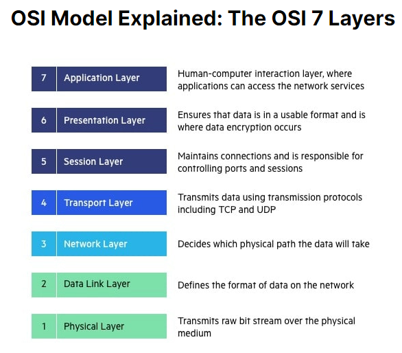

# Socket.io
## Web Socket
**1. What is a Web Socket?**

WebSocket is a computer communications protocol that enables full-duplex communication channels over a single TCP connection. It is designed to work over HTTP ports 443 and 80, making it compatible with HTTP and allowing support for HTTP proxies and intermediaries. 

**2. Describe the Web Socket request/response handshake and what happens once the connection is established.**

The WebSocket request/response handshake involves the client and server exchanging specific headers to negotiate and upgrade the connection to the WebSocket protocol. Once the handshake is successful, the client and server can communicate in a full-duplex manner, sending messages to each other without the need for explicit requests.

To establish a WebSocket connection, the client sends a WebSocket handshake request, for which the server returns a WebSocket handshake response.

**3. Web Sockets provide a standardized way for the server to send content to a client without first receiving a ____ from that client**

Request.
---

## Socket.io Tutorial

**1. What does the event handler io.on() do?** 
Sockets work based on events. There are some reserved events, which can be accessed using the socket object on the server side.
These are :
1-Connect.
2-Message.
3-Disconnect.
4-Reconnect.
5-Ping.
6-Join.
7-Leave.

The client-side socket object also provides us with some reserved events, which are :
1-Connect.
2-Connect_error.
3-Connect_timeout.
4-Reconnect, etc.

**2. Describe some possible proof of life or proof that the code works as expected**

Sending and Receiving Messages: The code can send and receive messages between the client and server. You can try to send data payloads to ensure that the messages are being transmitted correctly. 

**3. What does socket.emit() do?**
It's used to emit or send a custom event or message from the client to the server.

--- 

## Socket.io vs Web Sockets

**1. What is the difference between WebSocket and Socket.IO? (think Git and GitHub, or OAuth and Auth0).**

 WebSocket is a protocol for real-time, full-duplex communication, WebSocket remains open all the time, so they allow real-time data transfer, It doesn’t support broadcasting.	
 while Socket.IO is a library that enables real-time and full-duplex communication between the Client and the Web servers. It uses the WebSocket protocol to provide the interface, It supports broadcasting.	

**2. When would you use Socket.IO?**

When we want to create notifications and alerts system bacause Socket.IO can be utilized to push real-time notifications and alerts to connected clients.

**3. When would you use WebSockets?**

When we need to provides full-duplex communication, which helps in persisting the connection established between the Client and the Web Server like Real-Time Applications.

---
## OSI Model Explained

**1. What are a couple of key takeaways from this video?**
The Open Systems Interconnection (OSI) model describes seven layers that computer systems use to communicate over a network.
The OSI consists of seven layers, each representing a specific function in the network communication process.

 

## TCP Handshakes Explained
**1. Translate the gist of this video to a non-technical friend.**

Imagine you want to have a conversation with someone you've never met before. Before you can start talking, you both need to make sure you're ready to listen and respond to each other. This is what happens in a TCP handshake.

