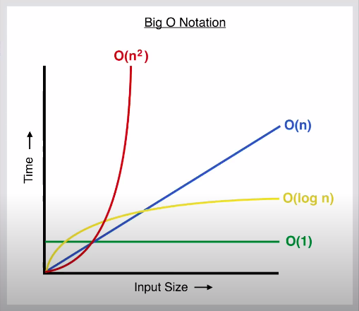

# Big O
### What is the Big O?
Big O is a mathematical syantical way that describes the code complexity , it refer to the input relation in your code , the lowest Big(O) the better.

### Key Concepts of Big O Notation:
1. Time Complexity: 
Time complexity measures how the runtime of an algorithm increases with the size of the input.
It quantifies the number of operations an algorithm needs to perform in relation to the input size.

2. Space Complexity:
Space complexity measures the amount of memory an algorithm requires to solve a problem with respect to the input size.
It quantifies the additional memory used by the algorithm, excluding the input itself.

### Diagram explain the Big O:
<br>


- Types of Big O:
1. O(1) - Constant Time Complexity.
Example : 
``` javascript
console.log(n);
````

2. O(n) - Linear Time Complexity.
Example: 
``` javascript
function print(n){
   for(let i = 1;i<=n;i++){ //O(n)
   console.log(i) //O(1)
}
O(n) * O(1) = O(n)
```

3. (n^2) - Quadratic Time Complexity.
Example:
``` javascript
function square(n){
  for (let i = 0; i < n; i++) {//O(n)
      for (let j = 0; j < n; j++) {//O(n)
        console.log(i, j);
      }
    }
}

O(n)*O(n) = O(n^2)
```

4. O(log n) - Logarithmic Time Complexity.
Example:
```javascript
// binary search 
let nums = [1,3,6,9,10,12,15,22,25,26,29,32,35,45......];

function search(num){
  for(let i=0;i<nums.lenght;i++){
    if(num==nums[i]){O(1)
      break;O(1)
      console.log('i found it')
    }
  }
  }
O(logn)*O(1)*O(1)*O(1)= O(logn)

```

5. O(n!) - Factorial Time Complexity.
Example:
``` javascript
function fact(n){
  let result = 1;
  if(n===0 || n===1){
    return 1;
  }
  else{
    return n*fact(n-1);
  }
}
``` 
6. O(nlogn):
``` javascript
function nlogn(n){
  let y= n;
  while(n>1){ 
    n= Math.floor(n/2);
    for(let i = 0 ; i<=y ;i++){
      console.log(i)
    }
  }
}

O(1)*O(logn)*O(1)*O(n)*O(1)= O(nlogn)
```


# Linked Lists
###  What is a Linked List?
A linked list is a linear data structure consisting of a sequence of nodes. Each node contains two components: data and a reference (or link) to the next node in the list. The first node is called the head, and the last node typically points to null, indicating the end of the list.
### Diagram explain the Linked List:
Linked list can be visualized as a chain of nodes, where every node points to the next node.

###  Types of Linked Lists:
1. Singly Linked List.
2. Doubly Linked List.
3. Circular Linked List

###  Why do we use Linked Lists?
Bacause it has many Advantages like:
Dynamic size, Flexibility and Efficient insertion and deletion.


### What are the main operations Linked List?
- Traversing: To traverse all nodes one by one.
- Insertion: To insert new nodes at specific positions.
- Deletion: To delete nodes from specific positions.
- Searching: To search for an element from the linked list.

### What are the application of a Linked List?
- A linked list is used to implement stacks and queues.
- A linked list also helps to implement an adjacency matrix graph.
- It is used for the dynamic memory location.
- The linked list makes it easy to deal with the addition and multiplication of polynomial operations.
- Implementing a hash table, each bucket of the hash table itself behaves as a linked list.
- It is used in a functionality known as undo in Photoshop and Word.