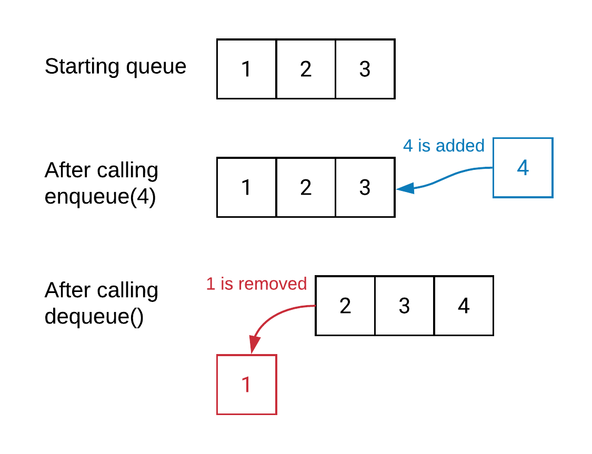

# Stacks and Queues
## Stacks
 

**What Does Stack Mean?**

Stack is a linear data structure that follows a particular order in which the operations are performed. The order may be LIFO(Last In First Out) or FILO(First In Last Out). LIFO implies that the element that is inserted last, comes out first and FILO implies that the element that is inserted first, comes out last.

**what are the common terminology used with stack ?**

- push: the function that is used to add elements into the stack.
- pop: the function that is used to remove elements from the stack.
- top (peek): a function that returns the first value (what is on top of the stack), but does not remove it.
- isEmpty: a function that checks if the stack is empty or not — helpful when trying to clear all the elements from a stack.
- size: a function that returns the number of elements that are in a stack at any given time.

**Big O**
the Big O for all of these termonolgys is Big O(1).

---
## Queues

 

**What Does Queue Mean?**

A Queue is defined as a linear data structure that is open at both ends and the operations are performed in First In First Out (FIFO) order.

**What is the principle of FIFO in queue?**
- A Queue is like a line waiting to purchase tickets, where the first person in line is the first person served.
- Position of the entry in a queue ready to be served, that is, the first entry that will be removed from the queue, is called the front of the queue(sometimes, head of the queue), similarly, the position of the last entry in the queue, that is, the one most recently added, is called the rear (or the tail) of the queue. See the below figure.

**what are the common terminology used with Queue ?**

- enqueue: the function that is used to add elements into the queue.
- dequeue: the function that is used to remove the first element from the stack.
- peek: a function that returns the first value (what is first in the queue), but does not remove it.
- isEmpty: a function that checks if the queue is empty or not — helpful when trying to clear all the elements from a queue.
- size: a function that returns the number of elements that are in a queue at any given time.

**Big O**
the Big O for all of these termonolgys is Big O(1).

 

- Resources : [Stacks&Queues](https://medium.com/basecs/stacks-and-overflows-dbcf7854dc67)

